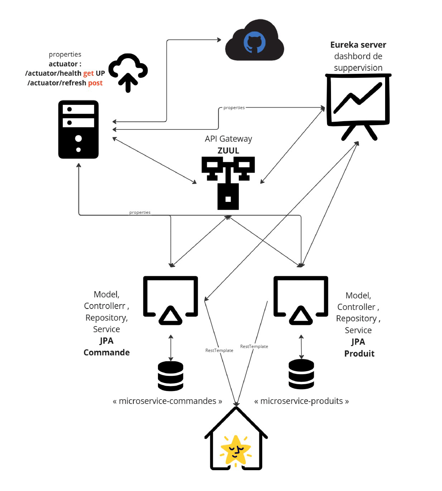

# Microservices with Spring Cloud

This project consists of two microservices , an API gateway , a Eureka Dashboard for monitoring and a Cloud Server to provide the configuration files :

1. **Config Server**
2. **Eureka Server**
3. **API gateway Server**
4. **ProduitMS**
5. **CommandeMS**
6. **WebappMS**

## Port Configuration

| Microservices                                  | Port |
|------------------------------------------------|------|
| Config Server                                  | 8000 |
| Eureka Server                                  | 9000 |
| API gateway Server                             | 9001 |
| Produit Microservice (microservice-produits)   | 9002 |
| Commande Microservice (microservice-commandes) | 9003 |
| Webapp (microservice-webapp)                   | 9010 |

---

# Etude de cas (1)

### Controller de l'API microservice-commandes

| Methode | Request List   | Function                               |
|---------|----------------|----------------------------------------|
| Get     | /historique    | retourne les commandes par date        |
| Get     | /commandes     | retourne tous les commandes            |
| Get     | /commande/{id} | retourne la commande selon le id       |
| Post    | /commande      | Enregistre ou met à jour les commandes |
| Delete  | /commande/{id} | supprime la commande selon l'id        |

---

# Etude de cas (2)

### Controller de l'API microservice-produits

| Methode | Request List  | Function                            |
|---------|---------------|-------------------------------------|
| Get     | /produits     | retourne tous les produits          |
| Get     | /produit/{id} | retourne le produit selon le id     |
| Post    | /produit      | Enregistre ou met à jour le produit |
| Delete  | /produit/{id} | supprime le produit selon l'id      |

---

# Schema de notre application

### Developed By

- **Asmae Moubarriz**
- **Achraf Akrache**
